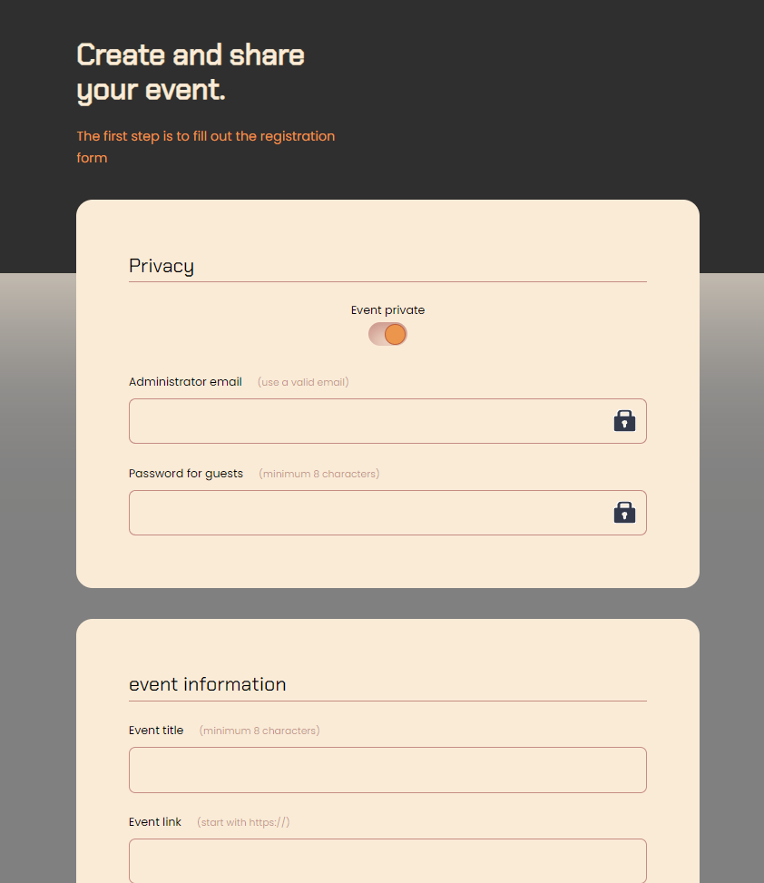

<h1 align="center">Hey 👋 What's up?</h1>

###

My name is Bruno. This is a simple form, with day and time, email, password, link and categories.

<h2 align="center">In this project I code with</h2> 

###

    
     
     
     

#

This is <a href="https://bhlx1992.github.io/form__event" title="Title"> Preview </a> link.

  

##
